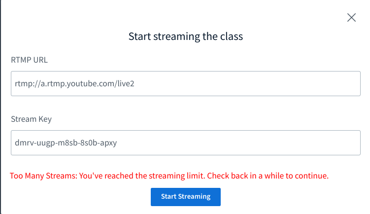
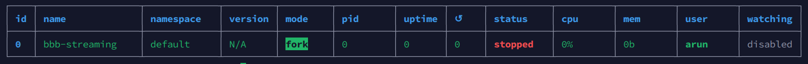
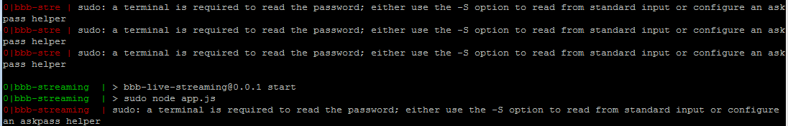

<div align="center">
 <a href="https://higheredlab.com/" target="_blank">  </a>
</div>
<h1 align="center">BigBlueButton Streaming</h1>
<p align="center">BigBlueButton Streaming - Your free, open-source solution to expand your virtual classrooms to thousands of learners globally. Stream live on YouTube, Facebook, Vimeo, or any RTMP server right from BigBlueButton. No more user limit - teach without boundaries.</p>

<br /><br/>
 <br/><br/>

<p>Embrace a limitless learning experience with BigBlueButton Streaming, the ultimate solution for your expanding educational needs. Developed as a free open-source software extension, BigBlueButton Streaming allows you to extend your virtual classrooms to thousands of learners around the globe.

Widely recognized as the leading open-source classroom software, BigBlueButton is trusted by countless educational institutions worldwide. However, with a capacity limit of 100 users per class, larger educational sessions became a challenge – until now.

Introducing BigBlueButton Streaming, your key to conducting large-scale, one-time events or regular oversized classes. Seamlessly stream your virtual classes directly from BigBlueButton to platforms such as YouTube, Facebook, Vimeo, or any RTMP server.

It's simple to use - enter the RTMP URL and access key, click on "Start Streaming", and voila! Your class is live and can now reach thousands of students concurrently. This intuitive, user-friendly tool breaks boundaries in digital learning, bringing education closer to those who crave it.

Experience this revolutionary extension today. Unleash the full potential of virtual learning with BigBlueButton Streaming, because education should know no boundaries.</p>

<br/><br/>

## 🗝️ Unlock Limitless Learning: Key Features of BigBlueButton Streaming

1. 📺 **Live Streaming on Multiple Platforms**: Directly stream your classroom to YouTube, Facebook, Vimeo, or any RTMP server, maximizing your reach and availability for students around the world.
2. 🎥 **Ease of Streaming:** Begin live streaming your classes simply by entering the RTMP URL and access key, and pressing "Start Streaming."
3. 🚀 **Large-Scale Class Capacity**: Accommodate thousands of students in a single class, bypassing the original 100 users limit of BigBlueButton.
4. 🔗 **Compatibility with BigBlueButton**: Works directly within BigBlueButton, the widely-adopted virtual classroom software used by many educational institutions globally.
5. 🆓 **Open-Source and Free**: BigBlueButton Streaming is an open-source software extension, available to all users at no cost.

<br/><br/>

## 💡 5 Benefits: Amplify Impact with BigBlueButton Streaming

1. 🌍 **Expanded Reach**: You can now teach thousands of students from various geographical locations simultaneously.
2. 📱 **Increased Accessibility**: With classes being streamed on popular platforms, students can access lessons from devices they already use in their everyday lives.
3. 💰 **Cost-Efficiency**: As a free, open-source software, BigBlueButton Streaming allows educational institutions to reduce costs associated with premium virtual classroom tools.
4. ⏰ **Flexibility and Convenience**: The ability to schedule large classes or one-time events provides flexibility to educators and convenience to learners.
5. 🧩 **Ease of Integration**: Being an extension of the already popular BigBlueButton, integrating this tool into existing educational frameworks is straightforward and hassle-free.

<br/><br/>

## 📋 Requirements

The requirement to install this software is BigBlueButton should be installed.

**Minimum environment requirements**

- The software is compatible with BigBlueButton versions ['2.6.10' '2.6.12' '2.7.0-beta.2']. Please ensure one of these versions is pre-installed.
- Docker must be installed on the system to manage containerization and deployment of     BigBlueButton.
- A properly configured and functioning TURN server is necessary for real-time communication and media relay.
- You should have a user account on your  system configured to execute sudo commands without the requirement to enter a password each time. This is crucial for some installation processes that require administrator-level permissions.

<br/><br/>


## 📦 Installation

- Clone the repository.
- Goto `bigbluebutton-streaming/`
- Run install.sh
```bash
git clone https://github.com/AsyncWeb/bigbluebutton-streaming.git

cd bigbluebutton-streaming

bash install.sh
```

> 🚨 Note: install.sh will restart the bigbluebutton server, please make sure there is no meetings running on the server.

> 💡 Make sure to stop streaming before Ending the BigBlueButton session.

<br/>

[📺 Installation Demo](https://bbb1.asyncweb.io/recording/bigbluebutton-streaming-installation.mp4)

<br/>
<br/>

## 🔗🔑 Set Default RTMP URL and Access Key

After successful installation, You can set default streaming server URL and access key by editing the `/usr/share/meteor/bundle/programs/server/assets/app/config/settings.yml` file.

```bash
public:
  app:
    # BigBlueButton-streaming rtmp URL and stream key.
    # set default streaming server URL and access key here.
    rtmpURL: ''
    streamKey: ''
```
Once you set the rtmp URL and stream key, restart the bigbluebutton html5 client.

```bash
sudo systemctl restart bbb-html5
```

<br/><br/>

## 🔄 Concurrent Streaming

If you aim to host multiple meetings simultaneously on your single BigBlueButton server and require concurrent streaming for each, follow these steps to set it up.

- Navigate to the streaming server directory:
```bash
cd bigbluebutton-streaming/streaming-server/
```

- Open the .env file for editing using sudo privileges. For instance, with the vi editor:
```bash
sudo vi .env
```

- In the .env file, modify the NUMBER_OF_CONCURRENT_STREAMINGS variable to indicate the number of simultaneous streams you want to handle. For instance, to enable three concurrent streams:
```bash
NUMBER_OF_CONCURRENT_STREAMINGS=3
```

- Save your changes and exit the file editor.

- Build  Docker image:
```bash
docker build -t bbb-stream:v1.0 .
```

- Finally, restart your bbb-streaming service with pm2:
```bash
pm2 restart bbb-streaming
```

<br />
Now, your server can handle the number of concurrent streams you've specified, allowing each meeting to be streamed simultaneously.


<br /> <br />


<div align="center">
   
</div>

<br />

> 🚨 Note: If you encounter the error shown above, it indicates that your server has reached its limit for concurrent streams.

<br />

> 💡 Remember: Successful operation of concurrent streaming depends significantly on the capacity of your server. Ensure that your server is capable of handling the number of concurrent streams you've set.

<br/><br/>


## 🗑️ Uninstallation

- Goto `bigbluebutton-streaming/`.
- run `uninstall.sh`.
```bash
cd bigbluebutton-streaming

bash uninstall.sh
```

<br/><br/>


## 🛠️ Troubleshooting

<br />

<div align="center">
   
</div>
<br/>

1. 🚨 When you encounter the error above, most likely the BigBlueButton-streaming backend (`bbb-streaming`) is not running. Please follow the steps below to troubleshoot:

    - Execute the command below to check whether `pm2` is present and is running the node application on your BigBlueButton server

        ```bash
        pm2 list
        ```
    
    <div align="center">
       
    </div>
     <br/>

    - If you find bbb-streaming listed above with status not as `online`, you would need to restart `bbb-streaming` by using the following command:

        ```bash
        pm2 restart bbb-streaming
        ```

    - Now, you would be seeing `bbb-streaming` status as online. 

    <div align="center">
       
    </div>

    <br/>


2. 🚨 If you encounter other errors, try looking for error logs by running the following command:

      ```bash
      pm2 logs bbb-streaming
      ```
<br/>

  - If you see error log as below, it means the error message you are seeing typically occurs when trying to use sudo in a script or automated process where no terminal is available to provide the password interactively.

    <div align="center">
       
    </div>
    <br/>

    - To fix this, a user to run sudo without needing to enter a password, you can modify the sudoers file.Here are the steps:

        - Open a terminal.
        - Type `sudo visudo`. This will open the sudoers file in the system's default text editor. The visudo command checks the syntax of the sudoers file to help prevent you from accidentally locking yourself out of the system.

        - Scroll down to the section of the file that looks like this:

        ```bash
        # User privilege specification
        root    ALL=(ALL:ALL) ALL
        ```

        - Underneath the root user, add the following line, replacing `username` with the username for which you want to allow passwordless sudo commands:

        ```bash
        username ALL=(ALL:ALL) NOPASSWD: ALL
        ```

        - Press `Ctrl+X` to exit the editor, then `Y` to save changes, and `Enter` to confirm.

        - Now Restart the `bbb-streaming` service by running the following command:

        ```bash
        pm2 restart bbb-streaming
        ```

        <br />

        Now, the user you added will be able to use `sudo` without being asked for a password. 

<br/>

> 📝If you find diffrent logs, share with us by creating an issue on this repository 📮. Please ensure to include relevant screenshots and a detailed description of the problem for better assistance.
 
<br /> <br />

3. 🚨 When you run `bash uninstall.sh`, and if encounter below error:
    ```
    permission denied while trying to connect to the Docker daemon socket at unix:///var/run/docker.sock: Get "http://%2Fvar%2Frun%2Fdocker.sock/v1.24/containers/json?filters=%7B%22ancestor%22%3A%7B%22bbb-stream%3Av1.0%22%3Atrue%7D%7D": dial unix /var/run/docker.sock: connect: permission denied
    ```
    - The error message you're encountering is related to the Docker permissions. Your user does not have the required permissions to interact with the Docker daemon. To fix this:
    
    - **Add your user to the docker group:** This is the most straightforward solution. It allows your user to interact with the Docker daemon as if you were the root user. 

        ```bash
        sudo usermod -aG docker $USER
        ```

      And then **log out and log back in** so that your group membership is re-evaluated.

    - Run again `bash uninstall.sh` and you should be good to go.

<br />

 >  ⚠️ If you still face issues in running streaming, please email us at support@higheredlab.com and we would be happy to help you. 


<br /><br />


## 🔎 How it works

1. 🚀 **Node.js App:** The Node.js app start streaming container, serving as a controller for streaming BigBlueButton meetings.

2. 📬 **REST API:** The app exposes a REST API to receive requests for starting and stopping streaming.

3. 🔑 **Environment Variables:** Sensitive data, such as the BigBlueButton URL, secret, and other configurations, are stored in environment variables loaded from a .env file.

4. 🔗 **Puppeteer Integration:** Puppeteer is utilized to launch a headless Chrome browser, enabling programmatic interaction with the BigBlueButton meeting UI. 

5. 🖥️ **Virtual Display:** Xvfb creates a virtual display for Chrome, allowing it to run without a physical display server.

6. 🤝 **Joining the Meeting:** The app configures Puppeteer to join the BigBlueButton meeting as a viewer with specific settings, such as listen-only mode and element visibility.

7. 📼 **Screen Recording:** A child process invokes ffmpeg to record the meeting screen and stream it to a specified RTMP server.

8. ⏹️ **Stop Streaming**: The app waits for the stop streaming or meeting to end and stops the, streaming, ffmpeg process, finalizing the streaming process.
<br /> <br />


<br/><br/>

## 🚀 <a href="https://higheredlab.com/bigbluebutton" target="_blank">Stress-free BigBlueButton hosting! Start free Trial</a>

**Save big with our affordable BigBlueButton hosting.**

- Bare metal servers for HD video
- 40% lower hosting costs
- Top-rated tech support, 100% uptime
- Upgrade / cancel anytime
- 2 weeks free trial; No credit card needed

<a href="https://higheredlab.com/bigbluebutton" target="_blank"><strong>Start Free Trial</strong></a>

